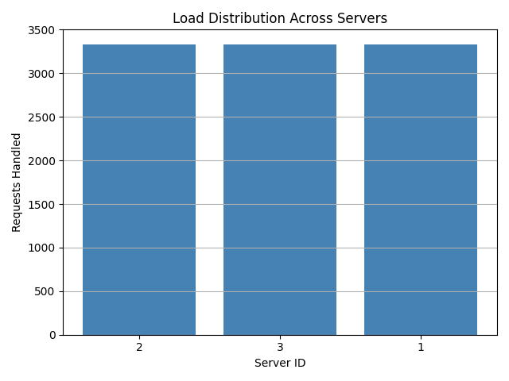
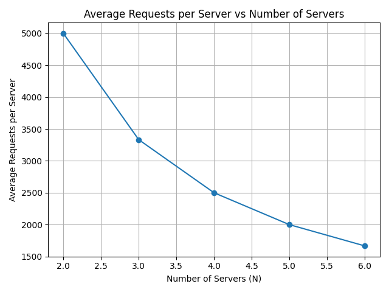

# Custom-Load-Balancer
This project is part of a distributed systems lab focused on implementing a **custom load balancer** that uses **consistent hashing** to distribute client requests across a set of replicated server containers. The objective is to simulate request routing, load balancing, and fault tolerance in a containerized environment.

---


## Project Overview

The system is built around two main components:

- **Client**: Contains the custom load balancer logic and consistent hashing algorithm.
- **Server**: A simple HTTP server that responds to requests forwarded by the load balancer.

Requests are routed from the client through the load balancer, which uses consistent hashing to determine the appropriate server to handle each request. This prevents any single server from being overloaded and enables graceful failure handling.

---


## 📁 Project Structure

```
.
├── client/                        # Load balancer + hashing logic
│   ├── consistent_hash.py        # Implements consistent hash ring (Φ, H)
│   ├── load_balancer.py          # Custom load balancer that routes requests
│   ├── test_client.py            # Simulates and tests load balancing
│   ├── dockerfile                # Dockerfile for load balancer container
│   ├── requirements.txt          # Python dependencies
│   └── venv/                     # Virtual environment (excluded in .dockerignore)
│
├── server/                       # Minimal HTTP server (Task 1)
│   ├── server.py                 # Flask server with /home and /heartbeat endpoints
│   ├── Dockerfile                # Dockerfile to containerize the server
│   └── requirements.txt          # Python dependencies for the server
│
├── docker-compose.yml           # Orchestrates client and multiple server containers
└── README.md                    # Project documentation
```
---


## Objective

To design and evaluate a lightweight, hash-based load balancing mechanism that:
- Evenly distributes requests across multiple server containers
- Uses consistent hashing with virtual replicas to ensure smooth transitions when servers are added or removed
- Handles server failure scenarios gracefully

---


## Implementation Summary

- **Task 1: Server Setup**  
  Created a simple Flask server with `/home` and `/heartbeat` endpoints and containerized it using Docker.

- **Task 2: Consistent Hashing**  
  Implemented a consistent hash ring with 512 slots and 9 virtual replicas per server. Applied lab-defined formulas `Φ(i,j)` and `H(i)` for mapping virtual servers and requests respectively.

- **Task 3: Load Balancer Logic**  
  Integrated the consistent hashing module into a custom load balancer that can route HTTP requests to the correct server container based on the hash ring.

- **Task 4: Analysis**  
  The load balancer was evaluated by simulating large volumes of requests under different configurations. Performance metrics such as request distribution, scalability with varying server counts, and fault recovery were analyzed. The following section presents observations and results from these experiments.

---


## Analysis Results
The following section presents request distribution results and fault-tolerance behavior observed during simulation:

## A-1

- Requests were evenly distributed across the 3 server containers (≈3333 each).
- This confirms that consistent hashing with virtual nodes achieves fair load balancing.
- No server experienced overload or starvation.




## A-2

As N Increases, the average number of requests decreases. Therefore, the load balancer scales well as more servers reduce the load.




## A-3

### Endpoints

/add


/home


/rep and /rm


Load Handling 


## A-4

We replaced our original polynomial-based hash functions:

- `H(i) = (i² + 2i + 17) % M`
- `Φ(i,j) = (i² + j² + 2j + 25) % M`

with SHA-256–based hashes for both request and virtual node mappings.

### Observations

- **A‑1**: Load distribution improved significantly — requests were split almost perfectly across replicas (e.g., 3333/3333/3334).
- **A‑2**: The scalability graph showed smoother averages and fewer inconsistencies as N increased.
- **Bonus**: Upon server removal, request redistribution became more balanced and less prone to overloading adjacent nodes.


